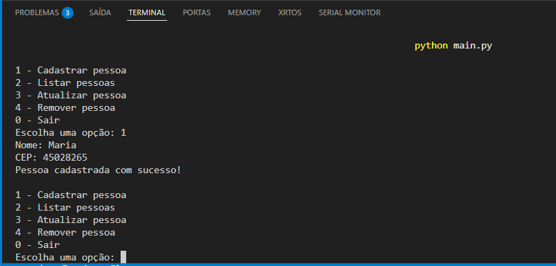
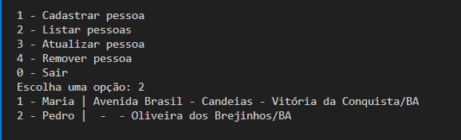
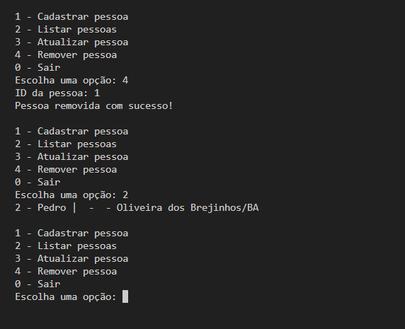
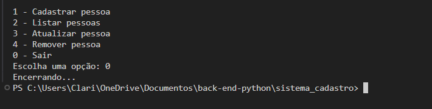

#  Sistema de Cadastro de Pessoas (Python)

Este projeto é uma é uma atividade extraclasse do programa Futuro Digital organizado pelo CEPEDI da trilha Back-end com Python, consiste em um **sistema simples de cadastro de pessoas**, desenvolvido em **Python**, utilizando o padrão de arquitetura **MVC (Model–View–Controller)**. O sistema funciona via **terminal**, permitindo ao usuário realizar operações básicas de CRUD (Create, Read, Update, Delete).

O projeto foi desenvolvido com fins **acadêmicos**, visando praticar conceitos fundamentais de organização de código, modularização e boas práticas em Python.

---

##  Conceitos Utilizados

* Linguagem Python
* Programação Orientada a Objetos (POO)
* Arquitetura MVC
* Separação de responsabilidades
* Execução via terminal
* Estruturas de controle e listas

---

##  Estrutura de Pastas

```
sistema_cadastro/
│
├── controller/
│   └── pessoa_controller.py
│
├── model/
│   └── pessoa.py
│
├── view/
│   └── pessoaView.py
│
├── integracoes/
│   └── (arquivos auxiliares, se aplicável)
│
├── main.py
└── README.md
```

### 📌 Descrição das Pastas

* **model/**: Contém as classes responsáveis pela representação dos dados (ex: Pessoa).
* **view/**: Responsável pela interação com o usuário (exibição de menus e leitura de entradas).
* **controller/**: Contém a lógica de negócio e faz a comunicação entre Model e View.
* **integracoes/**: Pasta reservada para possíveis integrações ou serviços auxiliares.
* **main.py**: Arquivo principal responsável por iniciar o sistema.

---

## ▶️ Como Executar o Projeto

### 1️⃣ Pré-requisitos

* Python 3.8 ou superior instalado
* Terminal (Prompt de Comando, PowerShell ou Terminal do VS Code)

### 2️⃣ Executando o sistema

No terminal, navegue até a pasta raiz do projeto e execute:

```bash
python main.py
```

---

## 📜 Funcionalidades do Sistema

Ao executar o programa, o seguinte menu será exibido:

```
1 - Cadastrar pessoa
2 - Listar pessoas
3 - Atualizar pessoa
4 - Remover pessoa
0 - Sair
```

### 🔹 1 - Cadastrar pessoa

Permite cadastrar uma nova pessoa informando os dados solicitados pelo sistema.




### 🔹 2 - Listar pessoas
Exibe todas as pessoas cadastradas no sistema.



### 🔹 3 - Atualizar pessoa

Permite atualizar os dados de uma pessoa existente a partir do seu identificador.

### 🔹 4 - Remover pessoa

Remove uma pessoa cadastrada utilizando seu identificador.




### 🔹 0 - Sair

Finaliza a execução do programa de forma segura.




---

##   Arquitetura MVC (Resumo)

* **Model**: Representa os dados e regras de negócio.
* **View**: Responsável pela interface com o usuário.
* **Controller**: Intermedia a comunicação entre Model e View, aplicando a lógica do sistema.

Essa separação facilita a manutenção, leitura e evolução do código.

---

## ✅ Observações Importantes

* CEP inválido não pode ser cadastrado
* O sistema é executado inteiramente via terminal.
* Os dados são armazenados em memória durante a execução.
* O projeto tem foco educacional.

---

## 👩‍💻 Autoria

Projeto desenvolvido por **Clarisse Santana Leite**, como atividade acadêmica para praticar Python e o padrão MVC.

---

##  Possíveis Melhorias Futuras

* Persistência de dados em arquivo ou banco de dados
* Validação mais robusta das entradas
* Interface gráfica
* Testes automatizados

---
